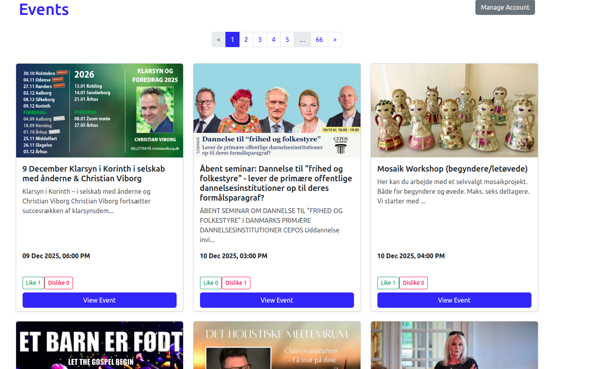
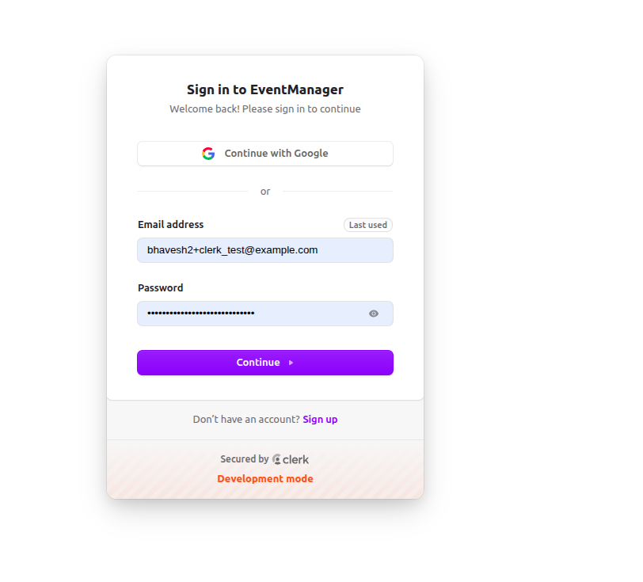

# 🎫 Event Voting Platform (Rails 7 + Clerk + Event Store)

A modern Rails 7 application that displays public events, allows authenticated users to vote (upvote/downvote) on events, and records all votes using **Rails Event Store** following an event-driven architecture.

This project demonstrates:

- 🔐 **User authentication with Clerk.com**
- ⚡ **Event-driven architecture** (Rails Event Store, projectors, event handlers)
- 📊 **Aggregated read models for live vote counts**
- 🎟️ **Event importer** from Billetto Public Events API
- 🔍 **Pagination** using Pagy
- 🎨 **Bootstrap 5 UI**
- 🚀 **Rails 7 + Turbo-ready structure**


## ✨ Features

### 🎟️ Event Listing
- Fetches events from the **Billetto Public API**.
- Displays event details in Bootstrap cards.
- Orders events with upcoming ones first.

### 🔐 Authentication (Clerk.com)
- Fully integrated Clerk middleware + authenticatable helpers.
- Redirects unauthenticated users to Sign In.
- Allows authenticated users to vote.

### 👍👎 Voting System
- Authenticated users may upvote or downvote events.
- Votes stored as **immutable events**:
  - `EventUpvoted`
  - `EventDownvoted`
- Real-time counters shown on event cards.
- Projector updates a local read model (`EventVote`).

### 📦 Rails Event Store
- JSON-serialized event bodies.
- Event handlers subscribe and update read models.
- Extensible architecture following CQRS principles.

---

## 🧰 Tech Stack

| Component | Technology |
|----------|------------|
| Backend | Ruby on Rails 7.1 |
| Auth | Clerk SDK for Ruby |
| Event Bus | Rails Event Store |
| Database | PostgreSQL |
| UI | Bootstrap 5 + ERB |
| Pagination | Pagy |
| API Integration | Billetto Public Events API |

---

## 🛠 Setup Instructions

### 1. Clone repo

```bash
git clone https://github.com/bhaveshrordev/eventmanagement.git
cd eventmanagement
```

### 2. Install dependencies

```bash
bundle install
yarn install --check-files
```

### 3. Database setup

```bash
rails db:create
rails db:migrate
```

### 4. Add environment variables

Create `.env`:

```bash
touch .env
```

Add:

```env
CLERK_SECRET_KEY=sk_test_**************
CLERK_PUBLISHABLE_KEY=pk_test_**************
CLERK_FRONTEND_API=your-subdomain.accounts.dev
CLERK_SIGN_IN_URL=https://your-subdomain.accounts.dev/sign-in

API_KEY_PAIR=YOUR_BILLETTO_API_KEY
```

### 5. Start server

```bash
bin/dev
```

---

## 🌐 Fetching External Events

Events are fetched via:

```
Billetto::EventsFetcher.new.import_all
```

The service:

- Calls Billetto Public API
- Imports events in pages (with pagination)
- Stores events using `Event.upsert`
- Avoids duplicates using `external_id`

---

## 👍👎 Voting Architecture

### 1. Controller publishes domain events:

```ruby
Rails.configuration.event_store.publish(
  EventUpvoted.new(data: payload)
)
```

### 2. Projector updates read model:

- `EventVote` stores upvote/downvote aggregates per event.
- Ensures **fast UI reads**.
- Keeps Event Store immutable & append-only.

### 3. UI displays vote counts:

```erb
👍 <%= event.event_vote_tally&.upvotes_count || 0 %>
👎 <%= event.event_vote_tally&.downvotes_count || 0 %>
```

---

## 🗄 Event Store Design

### Tables created:

#### `event_store_events`

Stores all domain events:

| Field | Description |
|-------|-------------|
| event_id (UUID) | Unique event ID |
| event_type | Class name (`EventUpvoted`) |
| data | JSON data payload |
| metadata | Request metadata |
| created_at | Timestamp |

#### `event_store_events_in_streams`

Links events to named streams.

---

## 🗂 Project Structure

```
app/
  controllers/
    home_controller.rb
  services/
    billetto/
      events_fetcher.rb
  projectors/
    votes_projector.rb
  models/
    event.rb
    event_vote.rb
config/
  initializers/
    event_store.rb
    clerk.rb
```

---

## 🖼 Screenshots





---

## 🚀 Future Improvements

- Realtime vote count updates (Turbo Streams)
- Prevent multiple votes per user per event
- Display user's previous vote state
- Background job for importing events periodically
- Store user profiles in local DB for auditing

---

## 👨‍💻 Author

**Bhavesh Saluja**  
Ruby on Rails Developer

---

## 📝 License

MIT License – free to use and modify.